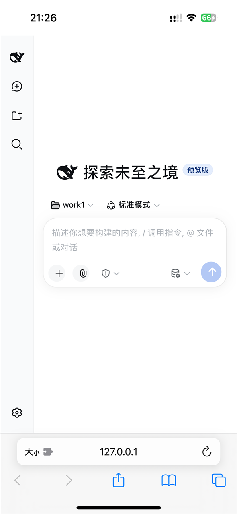

# dsh-ios

**English** | [中文](README.zh.md)

Run [DeepSeek Harness](https://github.com/deepseek-ai/deepseek-harness) (`dsh`)
on a jailbroken iPhone — with **no Mac, no Xcode, and no cross-compilation**.

```
┌─────────────────────────────────────────────┐
│  Safari → http://127.0.0.1:3080             │
│    dsh web UI, workspace picker, sessions   │
├─────────────────────────────────────────────┤
│  dsh                                       │
│    plugins · agent loop · tools             │
├─────────────────────────────────────────────┤
│  Node 22 (stock iphoneos-arm64 build)       │
│    --jitless · preloaded JS shims           │
├─────────────────────────────────────────────┤
│  iOS 17 / jailbroken                        │
└─────────────────────────────────────────────┘
```

Verified on **iPhone 15 (A16), iOS 17.1.1, Relaxin (rootHide)** with
**Node 22.19.0**.

<table>
<tr>
<td width="50%"></td>
<td width="50%"></td>
</tr>
<tr>
<td align="center"><em>DSH's own web UI, in Safari on the device. Session<br>list, workspace picker, model selector — the real<br>thing, not a mock-up.</em></td>
<td align="center"><em>Settings, with the permission mode on full<br>access. That is required here: <code>workspace-write</code><br>has no sandbox backend able to start.</em></td>
</tr>
</table>

Served from `127.0.0.1:3080`, loopback only. On desktop DSH opens a browser for
you; here `--no-open` is passed and the URL printed, with a fresh token each
launch.

### Read this before assuming it will work for you

Developed and verified against **exactly one configuration**. Nothing else has
been tried:

| | |
|---|---|
| Device | iPhone 15 (A16) |
| iOS | **17.1.1 — and nothing else** |
| Jailbreak | Relaxin (rootHide) |
| Node | 22.19.0 (`iphoneos-arm64`) |

The mechanisms this port depends on — the jbroot namespace split, the `mmap`
restriction on native modules, `--jitless` behaviour, the absent `gzip` — are
properties of the platform rather than of one iOS release, so the approach
should carry over. **But that is reasoning, not evidence.** On a different iOS
version, device or jailbreak, expect to re-derive the details. Treat
[`docs/ios-constraints.md`](docs/ios-constraints.md) as a checklist of things to
verify, not a guarantee that they hold.

In particular, a **rootless** jailbreak (Dopamine and relatives) will not have
the jbroot split described here in the same form — the namespace section is
specific to rootHide's layout.

### Practical notes

**A terminal on the device is required.** [NewTerm](https://repo.chariz.com/) is
what this was built and used with. Any POSIX shell should do; the scripts assume
nothing beyond `sh`.

**SSH from a computer is not required, but it is the single biggest time saver.**
Everything works from NewTerm alone. What SSH changes is how fast you can debug:
copy files with `pscp`/`scp` instead of retyping, run commands and read their
output directly instead of transcribing by hand, and iterate without switching
apps. This port was debugged over SSH, and the difference is not marginal.

**An SSH server must be installed on the device** — OpenSSH from the jailbreak
repos. There is no way around this: any client, including i4Tools' channel, ends
up talking to `sshd` *on the device*. i4Tools is convenient because it forwards
a local port over USB (usbmuxd), so no device IP or Wi-Fi is needed — but it is
a forwarder, not a server. Uninstalling OpenSSH makes it return
`Connection refused` while the i4Tools UI still cheerfully reports success, since
that dialog only reports that the tunnel was created, not that anything answered.

**The token is only needed once.** Safari keeps the cookie that
`?token=…` sets, so after opening the full URL a single time, plain
`127.0.0.1:3080` works from then on. Worth knowing, because the token changes on
every launch and is long enough to be genuinely annoying to retype — and it is
also why a stale bookmark can look like "the server is down".

---

## Why this port is different

There is at least one other iOS port of DSH, and it is a serious piece of work:
it cross-compiles Node with a patched V8 so that **full JIT works**, compiles
`node-pty` natively, and ships proper `.deb` packages. If you have a Mac and a
CI pipeline, **use that one** — it is faster and more complete.

This port makes the opposite trade. It takes a **stock** iOS Node build and
adapts at runtime, so the entire port is a set of JavaScript shims, one
byte-level binary patch, and three small edits to DSH itself. **Anyone can
reproduce it with a jailbroken phone and an SSH connection** — no build
toolchain of any kind.

That constraint is the whole design:

| | This port | Cross-compiled port |
|---|---|---|
| Build toolchain | **none** | macOS + Xcode (+ CI) |
| JIT | no (`--jitless`) | **yes** |
| Node | stock `iphoneos-arm64` build | custom build, V8 W^X patch |
| `node-pty` | macOS prebuild, one byte rewritten | compiled for iOS |
| ICU / Unicode regex | depends on the build | small-icu, `\p{...}` works |
| Images (`sharp`) | **pure-JS codec (works)** | shim (stated unavailable) |
| Delivery | scripts | `.deb` packages |

The two are complementary, not competing. Notes for anyone wanting to combine
them are in [`docs/ios-constraints.md`](docs/ios-constraints.md).

---

## Pitfalls this port exists to document

These cost the most time and are the least written down elsewhere. Each one is
expanded — with the commands to observe it and the wrong turns taken — in
[`docs/ios-constraints.md`](docs/ios-constraints.md) and
[`docs/jbroot-namespaces.md`](docs/jbroot-namespaces.md). **Read this table
before debugging anything on this platform.**

### Filesystem

| Pitfall | What actually happens |
|---|---|
| **`/var/mobile` means two different things** | A jailbreak shell resolves it *inside* jbroot; Node — a stock binary with no rootHide interposition — resolves it to the **real** root. Both are correct; they disagree. Absolute `/var/mobile/...` paths handed to Node therefore resolve to a directory that does not contain your files. **`cd` first and pass relative paths.** This one alone caused failures in `--import`, module resolution, config paths and UI behaviour, and was misdiagnosed as a sandbox problem for days. |
| **Native `.node` modules must live inside jbroot** | The same file, same signature, loads from jbroot and fails from the real `/var/mobile/Documents` with `file system sandbox blocked mmap()`. Adding `no-sandbox` to the entitlements does **not** help — the restriction is on the process, not the request. This is why the install cannot be placed somewhere that survives an un-jailbreak. |
| **A symlinked addon directory does not work** | `prebuilds/ios-arm64 → darwin-arm64` is followed by the loader, which then refuses the macOS file anyway. It has to be a real copy. |
| **`ENOENT` from `spawn` does not mean spawning is blocked** | It means **the path does not exist in this process's view**. The real `/bin` contains `df` and `ps`, nothing else — every jailbreak binary is under jbroot. `child_process` works fine once `PATH` points at real paths. This errno was misread as a sandbox denial and led to an entire wrong architecture for a while. |
| **`exec`ing a *script* is unreliable** | Spawning a binary works. Spawning a script whose `#!/…` interpreter the kernel must resolve did not — not as a shell path, not as Node's realpath, not via `#!/usr/bin/env node` with `node` on `PATH`. The kernel's view and the process's view cannot both be satisfied. **If the answer involves exec'ing a script, look for an in-process answer.** |
| **No `gzip`** | `tar` is present, `gzip` is not. `tar -xzf` fails with `gzip: cannot exec`. Decompress with Node's `zlib`. |

### Process management

| Pitfall | What actually happens |
|---|---|
| **`pkill -f` silently does nothing** | It returns success and kills nothing. A stale server keeps the port and the next launch dies with `EADDRINUSE`, having *appeared* to start. Use a pidfile; use `killall node` as a deliberately indiscriminate last resort; test a port by trying to bind it, since there is no `lsof`, `ss`, `netstat` or even `ps`. |
| **`su` is the BSD one** | No `-c`. Root SSH login was refused by default. |

### DSH behaviour that is easy to misread

| Pitfall | What actually happens |
|---|---|
| **Disabling `shell-env` breaks session creation** | The `standard` agent preset declares a `tool-bash` row that injects `shellEnv`. With `shell-env` off the preset cannot mount, so session creation fails — and the workspace picker just quietly reverts, with **nothing in the server log**. Profile boot does not catch it because presets mount lazily. |
| **Disabling a row can silently remove a service** | The boot audit *skips* disabled entries, so `subprocess` vanished without complaint and later dependents hung. |
| **Errors are swallowed** | The picker's handler threw and something caught the rejection: no log line, no on-screen message. [`tools/diag-overlay.js`](tools/diag-overlay.js) exists because of this — it found the real cause in one page load after several rounds of guessing. **Build the instrument before forming the hypothesis.** |
| **The request-image cache ignores the pixel budget** | Raising the budget has no effect on an image already sent once; the old, smaller encoding is reused. Clear `dsh-home/attachments/v1/request-images/`. Very easy to read as "the change didn't work". |
| **The cache version marker does not cover everything** | It was bumped for the WebP→PNG fix and still does not cover the budget change. Do not assume a config change invalidates anything. |

### Runtime

| Pitfall | What actually happens |
|---|---|
| **No JIT, and therefore no WebAssembly** | Undici — Node's `fetch` — compiles its HTTP parser from WebAssembly *at import*, so `fetch` cannot be loaded at all. |
| **Assigning `globalThis.fetch` loads undici** | The global is a lazy getter; the read-before-write is what triggers the import and the crash. Define the property instead. On the device tested, both preloads in order were needed. |
| **Ripgrep cannot be spawned, and its package does not exist** | `ripgrep-ios-arm64` is never published, and the `darwin-arm64` build links `libiconv.2.dylib`. Replaced with a pure-JS implementation called **in-process**. |
| **`sharp` has no path to working on iOS** | No iOS libvips. Replaced with a pure-JS codec — and this is the one capability a cross-compiled port reports as unavailable. |
| **A self-test can pass while the output is malformed** | Our own decoder ignored the JPEG `SOF0` segment length, so it read back the encoder's own bug without complaint while the API rejected every file. **Check produced bytes against the spec, not against your own reader.** [`fixtures/verify-image-codec.mjs`](fixtures/verify-image-codec.mjs) does this. |

---

## What works

| Capability | Status |
|---|---|
| Web UI in Safari (workspaces, sessions, multi-turn, trajectory view) | ✅ |
| Live DeepSeek API, streaming SSE | ✅ |
| `bash` — real command execution | ✅ |
| `read` / `write` / `edit` | ✅ |
| `glob` / `grep` | ✅ pure-JS ripgrep, called in-process |
| **Image attachments — upload and read** | ✅ **pure-JS `sharp` backend** |
| Session persistence (`jsonl.zstd`) | ✅ |
| Subagents, workflows, goals, todos, web search | ✅ |

## What does not

| Limitation | Why |
|---|---|
| No JIT | `--jitless`; expect an order of magnitude more CPU per unit of work |
| No WebAssembly | stubbed out; libraries built on wasm will not run |
| Sandboxing / FFI subprocess | `koffi` has no iOS build; stubbed |
| `worker_threads` | unavailable under the flags this build needs |
| Native npm addons | need an iOS build; the two DSH requires are handled specially |

---

## Install

Requirements: a **jailbroken** device with **Node 22 already present**, `ldid`,
and `tar`. If you are starting from nothing, see
[`docs/install-from-scratch.md`](docs/install-from-scratch.md).

```sh
git clone https://github.com/XLPOISTOP-prog/dsh-ios.git
cd dsh-ios
bash install.sh
```

`install.sh` is idempotent and dry-runnable (`--dry-run`). It will:

1. locate the DSH tree and refuse to guess if it cannot find it,
2. install the native-module shims,
3. overlay the pure-JS image codec into `node_modules/sharp`,
4. install the pure-JS ripgrep replacement,
5. copy the three patched DSH files,
6. rewrite the Mach-O platform byte on `pty.node` / `system.node` and re-sign,
7. inject the browser polyfills into the frontend's `index.html`.

Then:

```sh
sh scripts/start.sh          # prints a Safari URL
```

`scripts/start.sh` handles the parts that are easy to get wrong here — see
[`docs/jbroot-namespaces.md`](docs/jbroot-namespaces.md) for why it does what it
does. `scripts/stop.sh` stops it.

### Flags

```sh
sh scripts/start.sh 3081        # different port
DSH_SAFE=1 sh scripts/start.sh  # do not kill unrelated node processes
```

---

## How the hard parts are solved

Everything below is load-bearing; the reasoning and the things that did *not*
work are in [`docs/ios-constraints.md`](docs/ios-constraints.md).

### V8 without JIT, and `fetch`

`--jitless` means no WebAssembly, and Node's `fetch` is undici, whose HTTP
parser is a WebAssembly module compiled **at import**. So `fetch` cannot be
loaded at all.

Two preloads, in order:

1. **`preload/wasm-polyfill.js`** — supplies a `WebAssembly` global so undici can
   finish importing.
2. **`preload/fetch-https-shim.js`** — replaces `globalThis.fetch` with an
   implementation over `node:http`/`node:https`, using the native parser.

Both are needed. Note the shim installs via `Object.defineProperty`, not
assignment — `globalThis.fetch = …` triggers Node's lazy getter, which loads
undici, which is the crash.

### Images: a pure-JS `sharp`

There is no iOS libvips, so `sharp` cannot work. `sharp-ios/` is a from-scratch
replacement for the subset DSH uses:

```
exif.cjs     EXIF orientation
png.cjs      PNG decode + encode (zlib, de-filtering, CRC)
jpeg.cjs     JPEG decode (Huffman; baseline, extended-sequential,
             progressive; restart intervals) and encode
resize.cjs   resampling
sharp.cjs    the chainable sharp-shaped entry point
```

Five files, no dependencies beyond `node:fs` and `node:zlib`, and fully
self-contained. It is installed as an *overlay*: `npm install sharp` provides
the package, and the file that matters — `dist/index.cjs` — is redirected:

```js
// Package entry (CommonJS). Pure-JS implementation; see ./ios/sharp.cjs.
module.exports = require('./ios/sharp.cjs');
```

Verified by blind test: an image with randomly generated content was read back
correctly — the exact string, the shape, and both colours. Colour reporting
matters as evidence here, because a text-based representation cannot carry
colour, so the model must have received the actual image.

### `glob` / `grep` without ripgrep

`dsh-tool-fs-search` resolves `@vscode/ripgrep-<platform>-<arch>` and spawns it.
`ripgrep-ios-arm64` is never published, and the `darwin-arm64` build links
`/usr/lib/libiconv.2.dylib`, which iOS does not have.

`rg-ios/` is a pure-JS implementation of the two invocation shapes the plugin
actually uses — `--files` for glob and `--json` for grep, in ripgrep's documented
JSON schema — so the existing parser is untouched. It is called **in-process**
rather than spawned: spawning a script here is unreliable, because the kernel
resolves the shebang against a different filesystem view than the process that
created it (see the namespace doc).

### `node-pty`: one byte

The shipped macOS prebuild is refused by dyld with `have 'macOS', need 'iOS'` —
decided by the `LC_BUILD_VERSION` `platform` field, not by signature or
architecture. `tools/patch-macho-ios.mjs` rewrites that single byte (`1` → `2`)
and re-signs with `ldid`. No compilation, bit-exact, trivially reversible.

### The filesystem namespace

The single biggest source of lost time, and the one least documented elsewhere:
**the shell and Node disagree about what `/var/mobile` means.** Covered in full,
with the commands to observe it, in
[`docs/jbroot-namespaces.md`](docs/jbroot-namespaces.md).

Two consequences worth repeating up front:

* pass **relative** paths to Node, after `cd`-ing; do not pass `/var/mobile/...`
* native `.node` modules **must live inside jbroot** — iOS's sandbox blocks
  `mmap()` of executable code from the real `/var/mobile/Documents`

---

## Layout

```
install.sh                  idempotent installer
sharp-ios/                  pure-JS image codec  (5 files + docs)
rg-ios/                     pure-JS ripgrep replacement
preload/                    runtime shims: WebAssembly, fetch, browser polyfills
shims/                      native-module stand-ins: koffi, win32-process, flock
patched/                    the three modified DSH files + what changed and why
tools/                      Mach-O patcher, browser diagnostic overlay
scripts/                    start / stop / per-fix installers
docs/                       the two long-form design notes
```

---

## Known gaps

* **`no User-Agent` may be rejected.** `node:http` sends none, and some API
  gateways treat a UA-less call as a bot. The cross-compiled port reports
  `401 governor` responses fixed by adding `user-agent: node` to its fetch
  shim. **This port's shim does not do that.** If you hit unexplained 401s on
  calls that work elsewhere, that is the first thing to try.
* **The request-image cache ignores the pixel budget.** Changing
  `DEFAULT_REQUEST_IMAGE_PIXEL_BUDGET` does not affect images already sent once;
  clear `dsh-home/attachments/v1/request-images/`.
* **No `npm` CLI in most jailbreak Node packages** — you may need to copy
  `node_modules` from a development machine.
* Raising the image budget roughly doubles image token cost. It is a trade.

## Credits

Standing on:

* **The jailbreak.** Everything here is downstream of it. This port exists only
  because it is possible to run an unsandboxed binary on a device you own, and
  that is the work of people who gave their time to make it so:
  * **Relaxin** — the jailbreak this was built and verified against (iOS 17.1.1).
  * **roothide Bootstrap** — provides the jbroot mechanism that
    [`docs/jbroot-namespaces.md`](docs/jbroot-namespaces.md) spends 200 lines
    untangling. Every pointer in this repo about paths, `mmap` and `dlopen` is a
    consequence of that design, and it is a design that makes sense once you
    understand it.
  * **[Dopamine](https://github.com/opa334/Dopamine)** (opa334) and the rootless
    lineage it established — the approach most of the ecosystem now builds on.
  * **[Procursus](https://github.com/ProcursusTeam/Procursus)** — the bootstrap
    userland supplying the `ldid`, `tar` and `zsh` this installer depends on.

  None of this is a small thing to have done, and none of it is paid for.
* [DeepSeek Harness](https://github.com/deepseek-ai/deepseek-harness) — MIT
* [Cordis](https://github.com/cordiverse/cordis) — the plugin framework DSH is built on
* The **cross-compiled iOS port** ([`ddddddedcds/deepseek-harness-ios`](https://github.com/ddddddedcds/deepseek-harness-ios),
  branch `ios-port`, and its companion [`Node.js-for-ios`](https://github.com/ddddddedcds/Node.js-for-ios)).
  Its `docs/ios-port.md` is the most useful single document on this problem, and
  several of the notes in `docs/ios-constraints.md` exist because of it. This
  port takes the opposite approach to building Node, but the diagnosis of what
  iOS forbids overlaps heavily and is owed to that work.
* [`everettjf/dsh-ios`](https://github.com/everettjf/dsh-ios) — a different and
  equally valid strategy: run DSH inside an iSH-emulated Linux on the device.
  GPL-3.0; **no code from it is used here.**

## License

MIT — see [`LICENSE`](LICENSE). Third-party components and their terms are
listed in [`THIRD_PARTY_NOTICES.md`](THIRD_PARTY_NOTICES.md).
